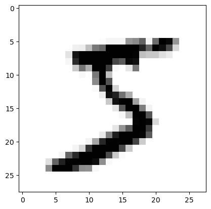
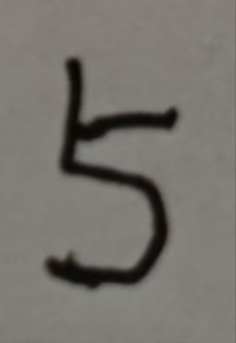
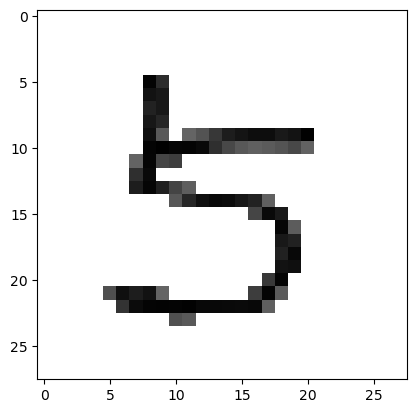

[toc]

本文档使用Typora食用更佳。

# 前言

记录从0开始搭建一个简单的模型，并且如何从简单模型扩展到复杂模型。当然，我会解释我为什么做这一步。希望这个笔记能够帮到代码初学者（有一点的深度学习和python基础）。注：这不是一个标准的搭建模型流程，具有强烈的个人代码习惯，但绝对能让你会搭建自己的模型。

# 分析

对于一个深度学习任务，分为以下几步：

* **数据处理**：将原始的数据处理成模型输入的数据，比如图片变成一个数字矩阵。
* **划分数据集**：数据集划分成训练集、验证集、测试集。
* **搭建模型**：搭建出你的模型。
* **模型训练**：使用训练集和验证集训练你的模型。
* **模型测试**：使用测试集来测试你模型的性能。

# 简单的例子

我们这里以mnist数据集为例子。这是一个经典的数据集。

## 环境配置

在开始环境之前我们需要先配置环境。

pytorch库  用于深度学习

matplotlib库  用于画图

numpy库  用于矩阵操作

cv2库  用于处理图片

## 数据处理

处理数据的时候要知道原始数据的样子，然后将原始数据处理成统一格式。我们所使用的到mnist数据集可以从pytorch直接下载，下载下来后直接就是统一格式。但如果是一张自己手机拍摄的照片，照片写了一个数字，这时候需要处理成训练数据的格式然后才能让模型进行精准的预测。这里的任务相当于把手机随便拍摄的一张图片转化为训练数据的格式。

首先我们看一下mnist训练数据的格式。有6万张训练集图片，和1万张测试集图片。每张图片都是由$28\times28$维度，值域[0,255]的矩阵组成。这里两个28分别代表照片的长和宽。默认通道是1，黑白图片是1通道，矩阵中值越大越黑；彩色图片是3通道，每个通道是对应RGB色彩深度（红绿蓝），三个色彩调和形成五颜六色。这些图片都是0-9的数字。

下面我们加载数据看一下

```python
import torchvision  #pytorch处理图像的库
import matplotlib.pyplot as plt  #画图的库
train_set = torchvision.datasets.MNIST(root='minist', train=True, download=False)
#加载mnist数据集。参数：
#root：放在哪个目录下
#train：是否为训练集
#download：是否下载数据集，如果本地没有数据集设为True，运行后会自行下载，下载后就可以设为False

#此时可以用len(train_set)查看长度为60000。
plt.imshow(train_set[0][0],cmap='Greys')
#这里绘制train_set第0张图片，第二个索引0是因为0是照片，1为标签，这里的标签是5。
#plt画图维度格式（长，宽，通道）。参数：
#cmap：设置颜色
```



为了使模型收敛更平稳，我们通常对图片进行归一化操作$x=\frac{x-min(x)}{max(x)-min(x)}$。这样图片值域变为[0,1]。这个操作pytorch有现成的方法。

```python
train_set = torchvision.datasets.MNIST(root='minist', train=True, transform = torchvision.transforms.ToTensor(), download = False)
#参数：
#transform：使用torchvision.transforms.ToTensor()，一个作用是换成张量，另一个作用是归一化，此时一张图片的维度是[1,28,28]
test_set = torchvision.datasets.MNIST(root='minist', train=False, transform = torchvision.transforms.ToTensor(), download = False)
#测试集只需要train参数设置为False
```

对于mnist数据集，数据处理到此结束。

对于一张随手拍的照片，我们需要处理成相同格式



```python
import cv2
import matplotlib.pyplot as plt
im = cv2.imread('./0_2.jpg')  #im.shape  (732, 837, 3)  长，宽，通道
imGray = cv2.cvtColor(im, cv2.COLOR_BGR2GRAY)  #将三通道图片灰度化为一通道，灰度化方式为cv2.COLOR_BGR2GRAY     
#imGray.shape (732, 837)
imGray = cv2.resize(imGray,(28,28))  #将图片缩放到(28,28)大小   imGray.shape (28, 28)
imGray = (255-imGray)/255  #图片归一化至0到1之间，这里255减imGray是为了让数字为黑，背景为白
imGray = imGray*(imGray>0.65)  #这里将小于0.65的颜色置为0，让灰色背景为纯白
plt.imshow(imGray,cmap='Greys')  #显示图片
imGray = imGray[None,:,:]  #将维度变为(1,28,28)
```



## 划分数据集

通常一份全新的数据需要划分成训练集和测试集。如果需要早停（模型训练到不收敛情况自动停止），则划分为训练集、验证集和测试集。在划分数据集的时候，通常会设置一些参数，batch size（GPU不可能一次性把所有数据放下，需要分批）和shuffle（是否打乱顺序，如果数据是按顺序排列的，先训练0再训练1，这样影响模型泛化性。验证集和测试集是不用打乱的）。

只将mnist数据集划分为训练集和测试集的情况已经划分好了。分批和随机打乱函数，

```python
batch_size=32  #设置一批32张图片
train_set = torch.utils.data.DataLoader(dataset=train_set, batch_size=batch_size, shuffle=True)  #训练集打乱
#len(train_set) 1875 = math.ceil(60000/32)  ceil表示向上取整 
test_set = torch.utils.data.DataLoader(dataset=test_set, batch_size=batch_size, shuffle=False)  #测试集不打乱
#len(test_set) 313 = math.ceil(10000/32)
```

mnist的常规划分方式到这里就结束了。

如果想要划分为训练集、验证集和测试集。首先我们从训练集中6w张取5k作为验证集，测试集不变。

```python
class ALDataset(torch.utils.data.Dataset): #这个类可以提取数据集输入到DataLoader函数进行分批
    def __init__(self,dataset):  #把数据集导入类
        self.ds=dataset
    def __getitem__(self,idx):  #idx是索引值，这个idx不需要管
        pic,label=self.ds[idx]  #提取第idx的图片和标签
        return pic,label  #返回图片和标签
    def __len__(self):
        return len(self.ds)  #数据长度
#分批可以理解成把数据一个一个取出来拼成一批
val_set = torch.utils.data.DataLoader(ALDataset([train_set[i] for i in range(55000,60000)]), batch_size, shuffle=False)
train_set = torch.utils.data.DataLoader(ALDataset([train_set[i] for i in range(55000)]), batch_size, shuffle=True)
test_set = torch.utils.data.DataLoader(ALDataset(test_set), batch_size, shuffle=False)
#继续调用DataLoader分批和打乱数据
#len(train_set)  1719   len(val_set)  157  len(test_set)  313
```

## 搭建模型

模型搭建是比较简单的事情了，我们就简单搭一个MLP。

```python
import torch.nn as nn  #调用nn更简单
device=torch.device('cuda:0' if torch.cuda.is_available() else "cpu")  #如果GPU可以用就用gpu，否则用cpu
class Net(nn.Module):   #模型是一个类，继承nn.Module类
    def __init__(self):
        super(Net,self).__init__()  #继承Module的初始化
        self.l1=nn.Linear(784,256)  #声明权重为784*256的线性层
        self.l2=nn.Linear(256,128)
        self.l3=nn.Linear(128,10)  #我们要预测0-9的概率，概率最大的值是我们预测的数字，所以最后一层有10个神经元
        self.relu=nn.ReLU()  #声明激活函数
        self.cost=nn.CrossEntropyLoss()  #声明交叉熵损失函数
    def forward(self,x):
        x=x.reshape(x.shape[0],-1)  #将图片拉直，784=28*28
        x=self.relu(self.l1(x))  #过一层线性层，过一个激活函数
        x=self.relu(self.l2(x))
        x=self.l3(x)  #最后一层不加激活函数
        loss=self.cost(x,y)  #交叉熵会自动对x计算softmax
        return x,loss
#以下三行代码验证网络是否正确
#net=Net().to(device)  #声明网络，并放入device，device一般是cpu或者gpu
#x=torch.randn(32,1,28,28).to(device)  #声明一个批大小为32的随机数矩阵，输入的数据也要放入device
#y=torch.ones(32).long().to(device)  #声明一个全1的y，long()表示tensor为int64类型，float类型交叉熵会报错
#net(x,y)[0].shape  #输入网络并查看输出维度，如果输出torch.Size([32, 10])，则说明模型没有问题
#如果模型和数据不在同一个设备会报错
```

为了加深印象，再来一个CNN版本的

```python
class Net(nn.Module):
    def __init__(self):
        super(Net,self).__init__()  
        self.c1=nn.Conv2d(1,8,kernel_size=(3,3),stride=1,padding=0)  #声明一个3*3卷积核，1步数，0填充，通道数从1升到8的卷积操作
        self.p1=nn.MaxPool2d(kernel_size=(3,3))  #声明一个3*3大小，3步数的最大池化操作
        self.l1=nn.Linear(512,128)
        self.l2=nn.Linear(128,10)
        self.relu=nn.ReLU()
        self.cost=nn.CrossEntropyLoss()
    def forward(self, x, y):
        x=self.p1(self.relu(self.c1(x)))
        x=self.relu(self.l1(x.reshape(x.shape[0],-1)))
        x=self.l2(x)
        loss=self.cost(x,y)
        return x,loss
#net=Net()
#x=torch.randn(32,1,28,28)
#y=torch.ones(32).long()
#net(x,y)[0].shape
```

## 模型训练&模型测试

直接从代码上分析

```python
epoch=10 #训练10轮
learn_rate=0.001  #设置0.001的学习率
model=Net().to(device)  #声明模型
optimizer=torch.optim.Adam(model.parameters(),learn_rate,weight_decay=0) #声明优化器
#这里我们选择Adam优化器，基本上都是这个优化器
#第一个参数放需要优化的参数，没有放进来的参数是不进行更新的，model.parameters()表示模型所有参数
#第二个参数设置模型学习率
#参数weight_decay表示权重衰减率，这里我们不用就设为0
for i in range(epoch):
    model.train()  #模型进入训练模式
    for x,y in train_set:  #按批取数据
        x,y=x.to(device),y.to(device)  #将数据放到device
        optimizer.zero_grad()  #梯度清0
        out,loss=model(x,y)  #正向传播
        loss.backward()  #反向传播
        optimizer.step()  #更新梯度
total,correct=0,0  #初始总图片数和预测对的数量
model.eval()  #模型进入评估模式，
with torch.no_grad():  #关闭模型参数梯度，可以加快评估速度
    for x,y in test_set:  
        x,y=x.to(device),y.to(device)
        out,loss=model(x,y)
        a=torch.argmax(out,-1)  #预测10个神经元，取最大概率值的索引为预测值
        total+=y.size(0)  #当前总数加上这一批数量
        correct+=(a==y).sum()  #当前正确数加上这一批预测正确数量
# correct/total    tensor(0.9186, device='cuda:0')   计算出准确率acc结果
```

上面是划分了训练集和测试集的情况，如果使用早停并使用验证集，我们就进行小小的改动

```python
class EarlyStopping:  #声明早停类
    def __init__(self,savepath,patience=3,delta=0):  #早停需要三个参数
        #第一个参数是存储路径，存最佳模型
        #patience表示最大耐心值，通常来说损失到底最低时模型性能达到最佳，最佳值下一次比本次高，也有可能下下次效果更好，所以说我们可以允许连续三次高于耐心值，第四次还高就早停
        #delta是允许当前值比最佳值的高的误差，在误差之内的情况也被允许
        self.savepath=savepath
        self.patience=patience
        self.bestscore=None  #最佳值
        self.delta=delta
        self.counter=0  #耐心值计数
        self.earlystop=False  #是否早停
    def __call__(self,score,model):
        fscore=-score  #根据情况取负，我们使用损失来早停，所以取负
        if self.bestscore is None:  #如果没有最佳值，存一下当前模型，并当前值为最佳值，通常是第一次调用类
            self.bestscore=fscore  
            torch.save(model.state_dict(),self.savepath)
        elif fscore<self.bestscore+self.delta:  #如果最佳值误差范围外
            self.counter+=1  #耐心值加1
            if self.counter>=self.patience:  #耐心值超过最大耐心值
                self.earlystop=True  #早停
        else:  #如果下降或在误差之内
            self.bestscore=fscore  #当前值就是最佳值  
            torch.save(model.state_dict(),self.savepath)  #存模型参数
            self.counter=0  #把耐心值置为0，耐心值的增加是连续的
epoch=100  #epoch设置大一点
learn_rate=0.001
model=Net().to(device)
ES=EarlyStopping("./Model.pkl")  #常见早停类
optimizer=torch.optim.Adam(model.parameters(),learn_rate,weight_decay=0)
for i in range(epoch):
    model.train()
    for x,y in train_set:
        x,y=x.to(device),y.to(device)
        optimizer.zero_grad()
        out,loss=model(x,y)
        loss.backward()
        optimizer.step()
    model.eval()  #每一轮都计算验证集损失
    with torch.no_grad():  
        loss_total=0  #初始累计损失值
        for x,y in val_set:  
            x,y=x.to(device),y.to(device)
            out,loss=model(x,y)
            loss_total+=loss.item()   #累计损失
    ES(loss_total,model)  #把本轮损失放入ES类比较
    if ES.earlystop :  #如果ES早停信号生效
        print('epoch'+str(i+1)+' stop')  #输出第几轮早停 e.g. epoch57 stop，如果没有输出就代表100轮也没有早停
        break  #跳出训练
total,correct=0,0
model.load_state_dict(torch.load('./Model.pkl'))  #加载最佳的模型
model.eval()
with torch.no_grad():
    for x,y in test_set:
        x,y=x.to(device),y.to(device)
        out,loss=model(x,y)
        a=torch.argmax(out,-1)
        total+=y.size(0)
        correct+=(a==y).sum()
# correct/total  tensor(0.9685, device='cuda:0')
```

## 案例分析

模型训练好了以后，我们手写一个数字，看一下能不能预测成功

```python
import cv2
import matplotlib.pyplot as plt
model=Net()
model.load_state_dict(torch.load('./Model.pkl'))
im = cv2.imread('./0_2.jpg')  
imGray = cv2.cvtColor(im, cv2.COLOR_BGR2GRAY)
imGray = cv2.resize(imGray,(28,28))  
imGray = (255-imGray)/255  
imGray = imGray*(imGray>0.65)  
plt.imshow(imGray,cmap='Greys') 
imGray = torch.tensor(imGray[None,None,:,:]).float()
out,_=model(imGray,torch.ones(1).long())
torch.argmax(out,-1)  #tensor([5])
```

完美预测！

## 完整代码纯净版

```python
import torch
import torch.nn as nn
import torchvision
device=torch.device('cuda:0' if torch.cuda.is_available() else "cpu")

batch_size=10240
class ALDataset(torch.utils.data.Dataset):
    def __init__(self,dataset):
        self.ds=dataset
    def __getitem__(self,idx):
        pic,label=self.ds[idx]
        return pic,label
    def __len__(self):
        return len(self.ds)
train_set = torchvision.datasets.MNIST(root='minist', train=True, transform=torchvision.transforms.ToTensor(), download=False)
test_set = torchvision.datasets.MNIST(root='minist', train=False, transform=torchvision.transforms.ToTensor(), download=False)
val_set = torch.utils.data.DataLoader(ALDataset([train_set[i] for i in range(55000,60000)]), batch_size, shuffle=False)
train_set = torch.utils.data.DataLoader(ALDataset([train_set[i] for i in range(55000)]), batch_size, shuffle=True)
test_set = torch.utils.data.DataLoader(ALDataset(test_set), batch_size, shuffle=False)

class Net(nn.Module):
    def __init__(self):
        super(Net,self).__init__()  
        self.c1=nn.Conv2d(1,8,kernel_size=(3,3),stride=1,padding=0)
        self.p1=nn.MaxPool2d(kernel_size=(3,3))
        self.l1=nn.Linear(512,128)
        self.l2=nn.Linear(128,10)
        self.relu=nn.ReLU()
        self.cost=nn.CrossEntropyLoss()
    def forward(self, x, y):
        x=self.p1(self.relu(self.c1(x)))
        x=self.relu(self.l1(x.reshape(x.shape[0],-1)))
        x=self.l2(x)
        loss=self.cost(x,y)
        return x,loss

class EarlyStopping:
    def __init__(self,savepath,patience=3,delta=0):
        self.savepath=savepath
        self.patience=patience
        self.bestscore=None
        self.delta=delta
        self.counter=0
        self.earlystop=False
    def __call__(self,score,model):
        fscore=-score
        if self.bestscore is None:
            self.bestscore=fscore
            torch.save(model.state_dict(),self.savepath)
        elif fscore<self.bestscore+self.delta:
            self.counter+=1
            if self.counter>=self.patience:
                self.earlystop=True
        else:
            self.bestscore=fscore
            torch.save(model.state_dict(),self.savepath)
            self.counter=0
epoch=100
learn_rate=0.001
model=Net().to(device)
ES=EarlyStopping("./Model.pkl")
optimizer=torch.optim.Adam(model.parameters(),learn_rate,weight_decay=0)
for i in range(epoch):
    model.train()
    for x,y in train_set:
        x,y=x.to(device),y.to(device)
        optimizer.zero_grad()
        out,loss=model(x,y)
        loss.backward()
        optimizer.step()
    model.eval()
    with torch.no_grad():
        loss_total=0
        for x,y in val_set:
            x,y=x.to(device),y.to(device)
            out,loss=model(x,y)
            loss_total+=loss.item()
    ES(loss_total,model)
    if ES.earlystop :
        print('epoch'+str(i+1)+' stop')
        break
total,correct=0,0
model.load_state_dict(torch.load('./Model.pkl'))
model.eval()
with torch.no_grad():
    for x,y in test_set:
        x,y=x.to(device),y.to(device)
        out,loss=model(x,y)
        a=torch.argmax(out,-1)
        total+=y.size(0)
        correct+=(a==y).sum()
print(correct/total)

import cv2
import matplotlib.pyplot as plt
model=Net()
model.load_state_dict(torch.load('./Model.pkl'))
im = cv2.imread('./0_2.jpg')  
imGray = cv2.cvtColor(im, cv2.COLOR_BGR2GRAY)
imGray = cv2.resize(imGray,(28,28))  
imGray = (255-imGray)/255  
imGray = imGray*(imGray>0.65)  
plt.imshow(imGray,cmap='Greys') 
imGray = torch.tensor(imGray[None,None,:,:]).float()
out,_=model(imGray,torch.ones(1).long())
print(torch.argmax(out,-1))
```

# 五折交叉验证

传统的数据划分将数据划分为训练集、验证集和测试集，模型的泛化性会受到数据划分影响。我们使用五折交叉验证的方法来充分利用数据。五折有很多版本，我选择最合理的版本。

```markdown
首先将数据集划分为训练集和测试集，然后将训练集分成五份，训练五次，五次用不同的一份当作验证集，其余为训练集。
```

如果直接将整个数据集划分为五分，用测试集来验证会导致训练集拟合到了测试集上，测试集理论上来说是不能出现在训练过程中的。所以先划分为训练和测试，然后直接对训练进行五折。

```python
import torch
import torch.nn as nn
import torchvision
device=torch.device('cuda:0' if torch.cuda.is_available() else "cpu")
k_fold=5

batch_size=10240
class ALDataset(torch.utils.data.Dataset):
    def __init__(self,dataset):
        self.ds=dataset
    def __getitem__(self,idx):
        pic,label=self.ds[idx]
        return pic,label
    def __len__(self):
        return len(self.ds)
train_set = torchvision.datasets.MNIST(root='minist', train=True, transform=torchvision.transforms.ToTensor(), download=False)
test_set = torchvision.datasets.MNIST(root='minist', train=False, transform=torchvision.transforms.ToTensor(), download=False)
val_sets,train_sets=[],[]
for k in range(k_fold):
    trainset,valset=[],[]
    for i in range(60000):
        if 12000*k<=i<12000*(k+1):
            valset.append(train_set[i])
        else:
            trainset.append(train_set[i])
    val_sets.append(torch.utils.data.DataLoader(ALDataset(valset), batch_size, shuffle=False))
    train_sets.append(torch.utils.data.DataLoader(ALDataset(trainset), batch_size, shuffle=True))
test_set = torch.utils.data.DataLoader(ALDataset(test_set), batch_size, shuffle=False)

class Net(nn.Module):
    def __init__(self):
        super(Net,self).__init__()  
        self.c1=nn.Conv2d(1,8,kernel_size=(3,3),stride=1,padding=0)
        self.p1=nn.MaxPool2d(kernel_size=(3,3))
        self.l1=nn.Linear(512,128)
        self.l2=nn.Linear(128,10)
        self.relu=nn.ReLU()
        self.cost=nn.CrossEntropyLoss()
    def forward(self, x, y):
        x=self.p1(self.relu(self.c1(x)))
        x=self.relu(self.l1(x.reshape(x.shape[0],-1)))
        x=self.l2(x)
        loss=self.cost(x,y)
        return x,loss

class EarlyStopping:
    def __init__(self,savepath,patience=3,delta=0):
        self.savepath=savepath
        self.patience=patience
        self.bestscore=None
        self.delta=delta
        self.counter=0
        self.earlystop=False
    def __call__(self,score,model):
        fscore=-score
        if self.bestscore is None:
            self.bestscore=fscore
            torch.save(model.state_dict(),self.savepath)
        elif fscore<self.bestscore+self.delta:
            self.counter+=1
            if self.counter>=self.patience:
                self.earlystop=True
        else:
            self.bestscore=fscore
            torch.save(model.state_dict(),self.savepath)
            self.counter=0
epoch=100
learn_rate=0.001
for k in range(k_fold):
    model=Net().to(device)
    ES=EarlyStopping("./Model_%d.pkl"%k)
    optimizer=torch.optim.Adam(model.parameters(),learn_rate,weight_decay=0)
    for i in range(epoch):
        model.train()
        for x,y in train_sets[k]:
            x,y=x.to(device),y.to(device)
            optimizer.zero_grad()
            out,loss=model(x,y)
            loss.backward()
            optimizer.step()
        model.eval()
        with torch.no_grad():
            loss_total=0
            for x,y in val_sets[k]:
                x,y=x.to(device),y.to(device)
                out,loss=model(x,y)
                loss_total+=loss.item()
        ES(loss_total,model)
        if ES.earlystop :
            print('epoch'+str(i+1)+' stop')
            break
acc=[]
for k in range(k_fold):
    total,correct=0,0
    model.load_state_dict(torch.load('./Model_%d.pkl'%k))
    model.eval()
    with torch.no_grad():
        for x,y in test_set:
            x,y=x.to(device),y.to(device)
            out,loss=model(x,y)
            a=torch.argmax(out,-1)
            total+=y.size(0)
            correct+=(a==y).sum()
    acc.append(correct/total)
# sum(acc)/k_fold  tensor(0.9752, device='cuda:0')
```

# 模型参数冻结

在LLM（大语言模型）训练的时候经常遇到模型参数冻结的情况。参数冻结之后，模型将不会更新这个参数了。

举个例子如下：

```python
import torch
import torch.nn as nn
class Net(nn.Module):    #创建一个模型
    def __init__(self):
        super(Net, self).__init__()
        self.fc1 = nn.Linear(128, 64)
        self.fc2 = nn.Linear(64, 32)
        self.fc3 = nn.Linear(32, 2)
        self.act=nn.ReLU()
    def forward(self,x):
        x=self.act(self.fc1(x))
        x=self.act(self.fc2(x))
        x=self.fc3(x)
        return x

net=Net()
optimizer = torch.optim.Adam(net.parameters(), lr=1e-2)  #声明优化器并将模型参数放入
for n,p in net.named_parameters():   #冻结fc2的参数，Linear有两个参数weight和bias
    if n=="fc2.weight" or n=='fc2.bias':
        p.requires_grad = False
    print(n,p.requires_grad)    #输出参数名和梯度状态
print(net.fc1.bias,net.fc2.bias,net.fc3.bias)    #输出参数
#进行一次梯度更新
optimizer.zero_grad()
out=net(torch.randn(5,128))
loss=nn.CrossEntropyLoss()(out,torch.tensor([0,1,0,1,0]).long())
loss.backward()
optimizer.step()
print(net.fc1.bias,net.fc2.bias,net.fc3.bias)  #再次输出参数 
```

我们观察一下结果发现，fc2的bias参数没有变化，fc1和fc3的bias变了。

```python
fc1.weight True
fc1.bias True
fc2.weight False
fc2.bias False
fc3.weight True
fc3.bias True
Parameter containing:
tensor([ 0.0501, -0.0188, -0.0115, -0.0359, -0.0085,  0.0824,  0.0880, -0.0576,
        -0.0066, -0.0497, -0.0562,  0.0132, -0.0010, -0.0279, -0.0447,  0.0523,
        -0.0328, -0.0090,  0.0482,  0.0097,  0.0012,  0.0075,  0.0795,  0.0194,
        -0.0115, -0.0617, -0.0040, -0.0269,  0.0756,  0.0811, -0.0215,  0.0503,
         0.0803,  0.0602, -0.0851,  0.0739, -0.0455,  0.0752, -0.0644,  0.0202,
         0.0465,  0.0408,  0.0534, -0.0442, -0.0780, -0.0667, -0.0738,  0.0066,
        -0.0703,  0.0702,  0.0127, -0.0478, -0.0408, -0.0620, -0.0455,  0.0524,
        -0.0100,  0.0258, -0.0273, -0.0032, -0.0480, -0.0315, -0.0171,  0.0248],
       requires_grad=True) Parameter containing:
tensor([-0.0268, -0.0635,  0.1077, -0.0370, -0.0291,  0.0456, -0.1242,  0.1185,
        -0.0171,  0.0892,  0.0159,  0.0938,  0.0493, -0.0356, -0.1100, -0.0848,
         0.0972, -0.0638, -0.0055, -0.0797, -0.1247, -0.0080,  0.0075, -0.1185,
         0.0588,  0.0287, -0.0840,  0.0560, -0.1025, -0.0235, -0.1144, -0.0650]) Parameter containing:
tensor([-0.0425,  0.0035], requires_grad=True)
Parameter containing:
tensor([ 4.0097e-02, -2.8764e-02, -1.5466e-03, -4.5905e-02, -1.8483e-02,
         9.2392e-02,  9.7993e-02, -6.7649e-02,  3.3993e-03, -3.9654e-02,
        -4.6179e-02,  3.1836e-03, -1.0965e-02, -1.7925e-02, -3.4655e-02,
         6.2315e-02, -2.2841e-02,  9.5072e-04,  5.8217e-02,  1.9672e-02,
        -8.7625e-03, -2.5107e-03,  6.9503e-02,  9.4055e-03, -2.1514e-02,
        -7.1736e-02, -3.9755e-03, -1.6950e-02,  8.5628e-02,  9.1104e-02,
        -1.1509e-02,  4.0260e-02,  9.0283e-02,  7.0237e-02, -9.5141e-02,
         8.3854e-02, -5.5500e-02,  7.5223e-02, -5.4407e-02,  2.0248e-02,
         5.6540e-02,  5.0784e-02,  6.3422e-02, -3.4176e-02, -6.7965e-02,
        -5.6708e-02, -6.3805e-02, -3.4461e-03, -8.0265e-02,  8.0223e-02,
         2.2736e-02, -3.7790e-02, -5.0766e-02, -5.2034e-02, -3.5470e-02,
         4.2357e-02, -4.4034e-05,  1.5800e-02, -3.7343e-02,  6.7774e-03,
        -3.7997e-02, -2.1468e-02, -7.0668e-03,  1.4816e-02],
       requires_grad=True) Parameter containing:
tensor([-0.0268, -0.0635,  0.1077, -0.0370, -0.0291,  0.0456, -0.1242,  0.1185,
        -0.0171,  0.0892,  0.0159,  0.0938,  0.0493, -0.0356, -0.1100, -0.0848,
         0.0972, -0.0638, -0.0055, -0.0797, -0.1247, -0.0080,  0.0075, -0.1185,
         0.0588,  0.0287, -0.0840,  0.0560, -0.1025, -0.0235, -0.1144, -0.0650]) Parameter containing:
tensor([-0.0325, -0.0065], requires_grad=True)
```

然后我们解冻fc2，冻上fc1再更新一轮参数

```python
for n,p in net.named_parameters():
    if n=="fc2.weight" or n=='fc2.bias':
        p.requires_grad = True
    if n=="fc1.weight" or n=='fc1.bias':
        p.requires_grad = False
    print(n,p.requires_grad)
print(net.fc1.bias,net.fc2.bias,net.fc3.bias)
optimizer.zero_grad()
out=net(torch.randn(5,128))
loss=nn.CrossEntropyLoss()(out,torch.tensor([0,1,0,1,0]).long())
loss.backward()
optimizer.step()
print(net.fc1.bias,net.fc2.bias,net.fc3.bias)
```

此时fc1的bias参数没有变，fc2和fc3的参数变了

```python
fc1.weight False
fc1.bias False
fc2.weight True
fc2.bias True
fc3.weight True
fc3.bias True
Parameter containing:
tensor([ 4.0097e-02, -2.8764e-02, -1.5466e-03, -4.5905e-02, -1.8483e-02,
         9.2392e-02,  9.7993e-02, -6.7649e-02,  3.3993e-03, -3.9654e-02,
        -4.6179e-02,  3.1836e-03, -1.0965e-02, -1.7925e-02, -3.4655e-02,
         6.2315e-02, -2.2841e-02,  9.5072e-04,  5.8217e-02,  1.9672e-02,
        -8.7625e-03, -2.5107e-03,  6.9503e-02,  9.4055e-03, -2.1514e-02,
        -7.1736e-02, -3.9755e-03, -1.6950e-02,  8.5628e-02,  9.1104e-02,
        -1.1509e-02,  4.0260e-02,  9.0283e-02,  7.0237e-02, -9.5141e-02,
         8.3854e-02, -5.5500e-02,  7.5223e-02, -5.4407e-02,  2.0248e-02,
         5.6540e-02,  5.0784e-02,  6.3422e-02, -3.4176e-02, -6.7965e-02,
        -5.6708e-02, -6.3805e-02, -3.4461e-03, -8.0265e-02,  8.0223e-02,
         2.2736e-02, -3.7790e-02, -5.0766e-02, -5.2034e-02, -3.5470e-02,
         4.2357e-02, -4.4034e-05,  1.5800e-02, -3.7343e-02,  6.7774e-03,
        -3.7997e-02, -2.1468e-02, -7.0668e-03,  1.4816e-02]) Parameter containing:
tensor([-0.0268, -0.0635,  0.1077, -0.0370, -0.0291,  0.0456, -0.1242,  0.1185,
        -0.0171,  0.0892,  0.0159,  0.0938,  0.0493, -0.0356, -0.1100, -0.0848,
         0.0972, -0.0638, -0.0055, -0.0797, -0.1247, -0.0080,  0.0075, -0.1185,
         0.0588,  0.0287, -0.0840,  0.0560, -0.1025, -0.0235, -0.1144, -0.0650],
       requires_grad=True) Parameter containing:
tensor([-0.0325, -0.0065], requires_grad=True)
Parameter containing:
tensor([ 4.0097e-02, -2.8764e-02, -1.5466e-03, -4.5905e-02, -1.8483e-02,
         9.2392e-02,  9.7993e-02, -6.7649e-02,  3.3993e-03, -3.9654e-02,
        -4.6179e-02,  3.1836e-03, -1.0965e-02, -1.7925e-02, -3.4655e-02,
         6.2315e-02, -2.2841e-02,  9.5072e-04,  5.8217e-02,  1.9672e-02,
        -8.7625e-03, -2.5107e-03,  6.9503e-02,  9.4055e-03, -2.1514e-02,
        -7.1736e-02, -3.9755e-03, -1.6950e-02,  8.5628e-02,  9.1104e-02,
        -1.1509e-02,  4.0260e-02,  9.0283e-02,  7.0237e-02, -9.5141e-02,
         8.3854e-02, -5.5500e-02,  7.5223e-02, -5.4407e-02,  2.0248e-02,
         5.6540e-02,  5.0784e-02,  6.3422e-02, -3.4176e-02, -6.7965e-02,
        -5.6708e-02, -6.3805e-02, -3.4461e-03, -8.0265e-02,  8.0223e-02,
         2.2736e-02, -3.7790e-02, -5.0766e-02, -5.2034e-02, -3.5470e-02,
         4.2357e-02, -4.4034e-05,  1.5800e-02, -3.7343e-02,  6.7774e-03,
        -3.7997e-02, -2.1468e-02, -7.0668e-03,  1.4816e-02]) Parameter containing:
tensor([-0.0368, -0.0535,  0.0977, -0.0470, -0.0191,  0.0356, -0.1142,  0.1085,
        -0.0271,  0.0792,  0.0059,  0.0838,  0.0393, -0.0356, -0.1200, -0.0748,
         0.0872, -0.0738,  0.0045, -0.0897, -0.1147, -0.0180,  0.0075, -0.1285,
         0.0688,  0.0387, -0.0940,  0.0460, -0.0925, -0.0235, -0.1144, -0.0550],
       requires_grad=True) Parameter containing:
tensor([-0.0225, -0.0165], requires_grad=True)
```

上面都是将参数冻结放到了优化器后面，如果我们将参数放到优化器冻结之后

```python
net=Net()
for n,p in net.named_parameters():
    if n=="fc2.weight" or n=='fc2.bias':
        p.requires_grad = False
    print(n,p.requires_grad)
print(net.fc1.bias,net.fc2.bias,net.fc3.bias)
optimizer = torch.optim.Adam(net.parameters(), lr=1e-2)
optimizer.zero_grad()
out=net(torch.randn(5,128))
loss=nn.CrossEntropyLoss()(out,torch.tensor([0,1,0,1,0]).long())
loss.backward()
optimizer.step()
print(net.fc1.bias,net.fc2.bias,net.fc3.bias)
```

此时fc2依然没有更新，fc1和fc3依然更新了

```python
fc1.weight True
fc1.bias True
fc2.weight False
fc2.bias False
fc3.weight True
fc3.bias True
Parameter containing:
tensor([ 0.0556,  0.0792, -0.0445,  0.0587, -0.0800,  0.0599,  0.0493, -0.0391,
        -0.0567, -0.0638,  0.0006, -0.0591,  0.0841,  0.0693, -0.0454,  0.0790,
        -0.0612,  0.0608, -0.0132,  0.0067, -0.0717,  0.0827, -0.0620, -0.0531,
         0.0413,  0.0800, -0.0140, -0.0265, -0.0827, -0.0883,  0.0420, -0.0641,
         0.0369, -0.0020, -0.0577,  0.0109,  0.0177,  0.0500,  0.0492,  0.0350,
         0.0753,  0.0040, -0.0860, -0.0293,  0.0384, -0.0635, -0.0020, -0.0220,
        -0.0484,  0.0621, -0.0115, -0.0041, -0.0397, -0.0803, -0.0831, -0.0380,
         0.0202,  0.0628,  0.0264,  0.0841,  0.0209,  0.0448,  0.0668,  0.0517],
       requires_grad=True) Parameter containing:
tensor([-0.1079,  0.0831,  0.0063, -0.0815,  0.0101,  0.0339,  0.1128, -0.0019,
         0.1064, -0.0021, -0.0363,  0.0467, -0.0012, -0.0081,  0.0282, -0.1014,
         0.1239,  0.0976, -0.0237,  0.1214,  0.1091, -0.0218,  0.0439,  0.0800,
        -0.0172, -0.0934, -0.0933,  0.0828, -0.0670,  0.0124,  0.1237, -0.0283]) Parameter containing:
tensor([0.1326, 0.0136], requires_grad=True)
Parameter containing:
tensor([ 0.0656,  0.0892, -0.0545,  0.0487, -0.0900,  0.0499,  0.0493, -0.0491,
        -0.0467, -0.0538,  0.0106, -0.0491,  0.0741,  0.0793, -0.0554,  0.0890,
        -0.0712,  0.0708, -0.0232, -0.0033, -0.0617,  0.0727, -0.0720, -0.0631,
         0.0513,  0.0900, -0.0040, -0.0365, -0.0927, -0.0983,  0.0520, -0.0541,
         0.0269,  0.0080, -0.0677,  0.0009,  0.0077,  0.0600,  0.0592,  0.0250,
         0.0653, -0.0060, -0.0760, -0.0193,  0.0284, -0.0735, -0.0120, -0.0120,
        -0.0384,  0.0521, -0.0215, -0.0141, -0.0497, -0.0703, -0.0731, -0.0280,
         0.0102,  0.0728,  0.0164,  0.0941,  0.0309,  0.0548,  0.0568,  0.0617],
       requires_grad=True) Parameter containing:
tensor([-0.1079,  0.0831,  0.0063, -0.0815,  0.0101,  0.0339,  0.1128, -0.0019,
         0.1064, -0.0021, -0.0363,  0.0467, -0.0012, -0.0081,  0.0282, -0.1014,
         0.1239,  0.0976, -0.0237,  0.1214,  0.1091, -0.0218,  0.0439,  0.0800,
        -0.0172, -0.0934, -0.0933,  0.0828, -0.0670,  0.0124,  0.1237, -0.0283]) Parameter containing:
tensor([0.1426, 0.0036], requires_grad=True)
```

对于优化器来说，如果不把参数放到优化器中是不更新的，比如下面这样：

```python
net=Net()
print(net.fc1.bias,net.fc2.bias,net.fc3.bias)
optimizer =  torch.optim.Adam([p for k,p in net.named_parameters() if 'fc2' not in k], lr=1e-2)
optimizer.zero_grad()
out=net(torch.randn(5,128))
loss=nn.CrossEntropyLoss()(out,torch.tensor([0,1,0,1,0]).long())
loss.backward()
optimizer.step()
print(net.fc1.bias,net.fc2.bias,net.fc3.bias)
```

我们并没有将fc2放到优化器中，更新一轮后。fc2的参数没有变化

```python
Parameter containing:
tensor([-0.0452, -0.0748, -0.0083, -0.0170,  0.0697,  0.0078, -0.0168, -0.0477,
         0.0400, -0.0138,  0.0588, -0.0844,  0.0417, -0.0162,  0.0201, -0.0305,
        -0.0055,  0.0698,  0.0841, -0.0204, -0.0639,  0.0694, -0.0410, -0.0300,
        -0.0179, -0.0402, -0.0750, -0.0878, -0.0640, -0.0046,  0.0032,  0.0591,
        -0.0310, -0.0210,  0.0569,  0.0156,  0.0859, -0.0455, -0.0458, -0.0473,
        -0.0303,  0.0586,  0.0358,  0.0339,  0.0585, -0.0158, -0.0239,  0.0015,
        -0.0579, -0.0108, -0.0822,  0.0056,  0.0644,  0.0100, -0.0504,  0.0179,
         0.0590,  0.0784,  0.0547, -0.0306, -0.0596, -0.0401, -0.0760, -0.0417],
       requires_grad=True) Parameter containing:
tensor([-0.0442, -0.0613, -0.0219, -0.0378, -0.0904, -0.0658,  0.0741, -0.1119,
         0.0455,  0.0073,  0.0928,  0.0202,  0.0981,  0.0714, -0.1130, -0.1079,
         0.1145, -0.0183, -0.0009,  0.1209, -0.1120,  0.0395,  0.0539, -0.0561,
        -0.0692, -0.1098,  0.0045,  0.0595,  0.0812,  0.1177,  0.1077,  0.0188],
       requires_grad=True) Parameter containing:
tensor([ 0.0568, -0.0790], requires_grad=True)
Parameter containing:
tensor([-3.5155e-02, -6.4805e-02,  1.6720e-03, -6.9537e-03,  7.9707e-02,
        -2.2397e-03, -2.6779e-02, -5.7693e-02,  3.0047e-02, -3.7663e-03,
         6.8784e-02, -9.4378e-02,  3.1673e-02, -2.6213e-02,  1.0142e-02,
        -2.0504e-02,  4.5096e-03,  7.9819e-02,  7.4080e-02, -3.0362e-02,
        -7.3921e-02,  7.9439e-02, -3.0984e-02, -4.0036e-02, -7.8815e-03,
        -3.0152e-02, -8.5013e-02, -9.7760e-02, -5.4018e-02, -1.4589e-02,
        -6.7900e-03,  6.9067e-02, -4.1031e-02, -3.0980e-02,  6.6884e-02,
         5.6048e-03,  9.5950e-02, -4.5513e-02, -3.5752e-02, -3.7252e-02,
        -2.0333e-02,  6.8578e-02,  2.5759e-02,  2.3947e-02,  4.8493e-02,
        -2.5826e-02, -1.3926e-02,  1.1491e-02, -5.7875e-02, -7.7843e-04,
        -7.2197e-02,  1.5560e-02,  5.4414e-02, -1.3709e-06, -4.0360e-02,
         7.8587e-03,  4.9024e-02,  8.8422e-02,  4.4680e-02, -4.0618e-02,
        -4.9553e-02, -3.0110e-02, -8.5983e-02, -3.1731e-02],
       requires_grad=True) Parameter containing:
tensor([-0.0442, -0.0613, -0.0219, -0.0378, -0.0904, -0.0658,  0.0741, -0.1119,
         0.0455,  0.0073,  0.0928,  0.0202,  0.0981,  0.0714, -0.1130, -0.1079,
         0.1145, -0.0183, -0.0009,  0.1209, -0.1120,  0.0395,  0.0539, -0.0561,
        -0.0692, -0.1098,  0.0045,  0.0595,  0.0812,  0.1177,  0.1077,  0.0188],
       requires_grad=True) Parameter containing:
tensor([ 0.0668, -0.0890], requires_grad=True)
```


